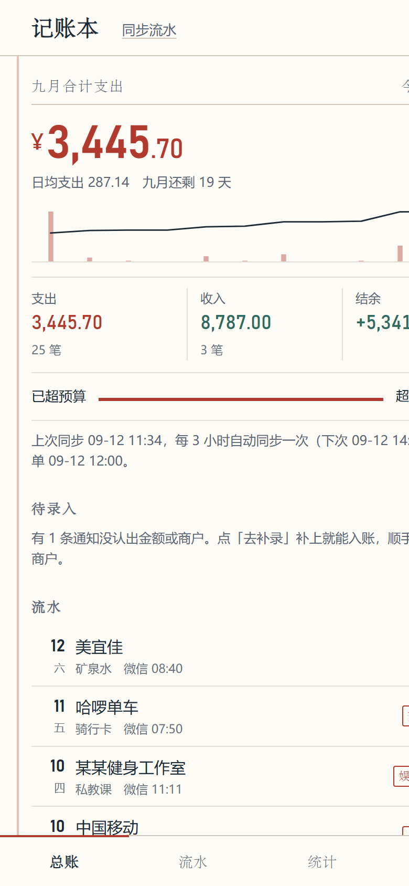
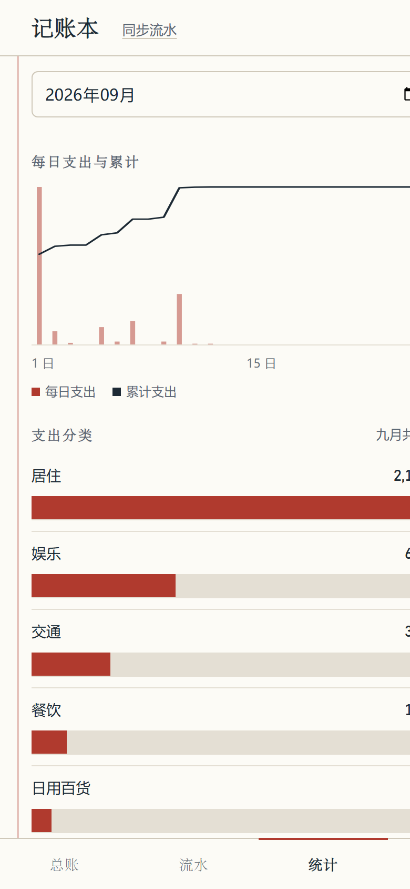
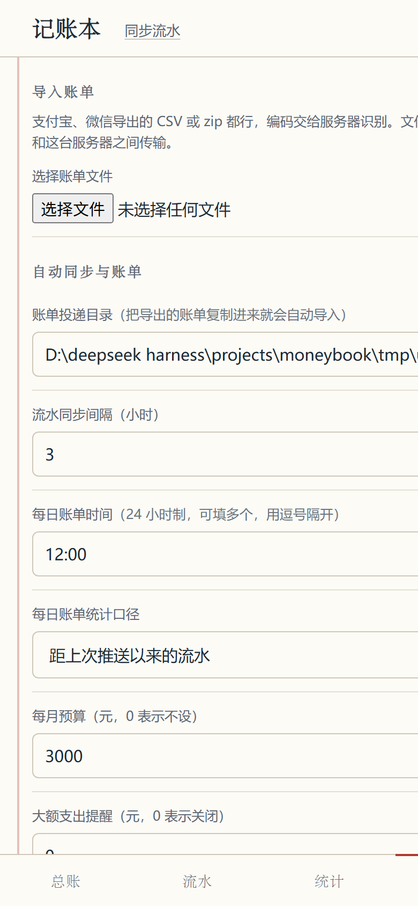

# 记账本 · moneybook

<p align="center">
  
  
  
  
</p>

<p align="center">
  <a href="https://github.com/zyz674/moneybook/actions/workflows/ci.yml"></a>
  
  
  
</p>

一个跑在**你自己设备**上的个人记账工具：自动收集支付宝 / 微信流水，汇总成收支明细，
每 3 小时自动同步一次，每天定时（默认 0 点和 12:00 两次）生成并推送一份每日账单。

**两种用法，按需要选：**

| | 纯前端版（点开就能用） | 服务端版（全自动） |
| --- | --- | --- |
| 打开方式 | **<https://zyz674.github.io/moneybook/>** | 自己电脑 / 服务器 / 手机 Termux 跑起来 |
| 安装 | 不用装，点链接就行 | 需要 Python 3.9+ |
| 数据在哪 | **只在你手机/电脑的浏览器里**（IndexedDB），不上传 | 你自己机器的 `data/moneybook.db` |
| 账单导入 | 手动上传导出的 CSV | 每 3 小时自动扫描投递目录 |
| 通知自动抓取 | ❌ 浏览器做不到 | ✅ Android 通知监听 / 短信 / 快捷指令 |
| 每天定时推送 | 页面开着时到点提醒 | ✅ 到点推送，不用开 App |
| 适合 | 想立刻试试、或不想折腾的朋友 | 长期日常使用 |

- 纯 Python 标准库实现，**零第三方依赖**，电脑 / 手机 Termux / 服务器都能跑
- 数据只存在你自己的机器上（SQLite 文件），不经过任何第三方服务
- 手机浏览器打开即用，可「添加到主屏幕」当 App 用（自带图标、深色模式）
- 📱 **iPhone 用户看这里 → `docs/iPhone使用指南.md`**（含账单导出、zip 解压、快捷指令、备份）
- 多通道抓取 + 自动去重：同一条交易从通知和官方账单两次进来也只记一笔

> 手机端界面是一张「账页」：宋体做账目标题、印章做分类标记、窄体数字做金额。
> 上面四张图分别是总账、流水、统计、分类规则。

---

## 1. 三分钟上手

### 方式 A：点链接就用（纯前端版，零安装）

**<https://zyz674.github.io/moneybook/>**

- 手机浏览器打开 → 右上角「导入账单」选支付宝/微信导出的 CSV → 立刻出账
- 想当 App 用：Safari/Chrome 菜单里「添加到主屏幕」
- **数据只存在你自己这台设备的浏览器里**（IndexedDB），不上传、不需要注册
- 代价：没有后台自动抓取，也不会在你不开页面时推送账单 —— 要这些就用方式 B

### 方式 B：自己跑服务端（全自动）

**Windows**

1. 双击 `run.cmd`（需要 Python 3.9+，安装时勾选 Add to PATH）
2. 窗口里会打印两个地址，例如：
   - 本机：`http://127.0.0.1:8787`
   - 手机：`http://192.168.1.100:8787`（手机连同一个 WiFi 后打开）
3. 先把 `samples/` 里的样例账单拖进 `data/inbox/`，点界面上的「同步」看效果

**macOS / Linux / Termux**

```bash
./run.sh              # 或 python3 -m moneybook（需 PYTHONPATH=src）
```

**手机上（安卓 Termux）**

```bash
pkg install python
cd moneybook && ./run.sh --port 8787
```

启动后手机浏览器访问 `http://127.0.0.1:8787`，Safari/Chrome 菜单里选「添加到主屏幕」。
想开机自启，见 `docs/部署与使用.md`。

**Docker（NAS / 服务器最省事）**

```bash
docker build -t moneybook .
docker run -d --name moneybook -p 8787:8787 \
  -v moneybook-data:/app/data \
  -e MONEYBOOK_TOKEN=换成你的口令 \
  moneybook
```

> ⚠️ 一定要挂 `-v` 数据卷。免费云平台的容器磁盘是临时的，重建就丢数据，
> 记账数据丢不起——要么用 NAS/VPS 常驻，要么定期把 `data/moneybook.db` 备份出来。
> 容器里也可以用 `-v /你的目录:/app/data` 直接挂到宿主机目录，方便备份。

---

## 2. 它怎么"自动读取"支付宝和微信

这里要说实话：**支付宝和微信都没有给个人开放的流水接口**，App 的私有数据库在
Android/iOS 沙箱里也读不到（除非 root / 越狱，不推荐）。所以本工具用三条现实可行的通道，
可以同时开，系统会自动去重合并：

| 通道 | 平台 | 自动程度 | 准确度 | 说明 |
| --- | --- | --- | --- | --- |
| A. 通知监听 | Android | 实时自动 | 中（部分通知不含金额） | 监听「支付宝 / 微信支付 / 银行」通知，POST 到 `/api/ingest` |
| B. 账单文件投递 | 全平台 | 每 3 小时自动扫描 | 高（官方数据） | 把导出的 CSV 丢进 `data/inbox/`，或从手机页面上传 |
| C. 截图 / 短信转发 | iOS / Android | 半自动 | 中 | iOS 快捷指令 OCR 后 POST；安卓短信转发器转发银行短信 |

通道 B 的账单来源（官方导出，全部免费）：

- 支付宝：App →「我的」→「账单」→ 右上角「…」→「开具交易流水证明」→ 选「用于个人对账」→ 邮箱收到 CSV（**GBK 编码**，本工具自动识别）
- 微信：App →「我」→「服务」→「钱包」→「账单」→ 右上角「常见问题」→「下载账单」→ 选「用于个人对账」→ 邮箱收到 CSV（**UTF-8 BOM**，自动识别）

> 详细配置（含 Android 通知监听的具体做法、iOS 快捷指令、自写抓取 App 的代码）见
> `docs/数据来源与抓取.md`。

---

## 3. 功能一览

**收支明细**
- 自动分类（内置 287 条中文商户规则 + 6 条条件规则：肯德基→餐饮/快餐、滴滴→交通/打车、餐饮按时段分早/午/晚/夜宵……）
- **条件式规则**：关键词、金额区间、时间段、支付方式、渠道都能当条件；动作除了归类，还能「标记不计收支」「直接忽略」「只打标签」——详见 `docs/规则引擎.md`
- 你在 App 里改一次分类，它就会记住这个商户，下次自动归类；也能按商户一次性批量改
- 转账、信用卡还款、余额宝转出、已关闭订单自动识别为「不计收支」，不虚增消费
- 5 元以内自动打「小额」标签，月末能看清零钱都花哪了

**没认出来的交易不会丢**
- 通知里没有金额、格式不认识的，进「待录入」队列，首页会提示；点开看到原文，补上金额和商户就入账，并自动记住这个商户

**固定支出（订阅）识别**
- 同商户、同金额连续几个月都出现 → 判定为固定支出（会员续费、房租、话费），统计页单列，并预测下次扣款日
- 判定用「连续月份」而不是平均间隔，同一个月多买一次不会破坏判断

**常去的商户**
- 按商户聚合当月消费，点一下就能批量改分类并生成规则

**每日账单（默认 12:00 推送）**
```
📊 记账本 · 09-11 12:00 ~ 09-12 12:00 周六
────────────────
💸 支出 ¥128.50（12 笔）
💰 收入 ¥0.00（0 笔）
📉 结余 -¥128.50
📈 较上一周期 ↑12.3%
────────────────
分类占比
  餐饮   ¥65.00   ████████░░ 51%
  交通   ¥23.50   ███░░░░░░░ 18%
🏦 微信 ¥98.00｜支付宝 ¥30.50
📅 本月累计支出 ¥1,234.00｜预算 ¥3,000.00（41.2%）███░░░░░░░
```
- 统计口径默认「自动」：**0 点那次汇总刚过去的自然日，12 点那次汇总这半天**（也可固定为某一种）
- 推送时间可配多个，例如 `["12:00", "22:00"]`
- 另有周报（默认周一 09:00）与月报（默认每月 1 日 09:00）
- 大额支出实时提醒、预算超支提醒

**推送通道**（配一个就行）
Bark / Server酱 / PushPlus / ntfy / Telegram / 企业微信机器人 / 钉钉机器人 / 飞书机器人 / 自定义 Webhook / 只打印到控制台

**一键快记（给手机快捷指令 / 自动化用）**
- `GET /quick?format=text&text=12.5 肯德基` 一句话就能记账，自动认金额、收支方向、分类
- 配合 iPhone「轻点背面」或安卓桌面小组件，付款后两秒记完
- 详细配置见 `docs/iOS快捷指令.md`

**其它**
- 手机端可直接上传账单文件、手工记一笔、逐笔改分类、看每日柱状图与分类排行
- 导出全部流水为 CSV
- 访问口令保护，任务日志 / 导入记录 / 推送记录都可查

---

## 4. 定时任务

| 任务 | 默认 | 配置项 |
| --- | --- | --- |
| 扫描 `data/inbox/` 并导入新账单 | 每 3 小时 | `sync.interval_hours` |
| 拉取远端账单链接 | 同同步周期 | `sync.pull_urls` |
| 生成并推送每日账单 | 每天 **00:00 和 12:00** | `reports.daily_times` |
| 周报 / 月报 | 周一 09:00 / 每月 1 日 09:00 | `reports.weekly` / `reports.monthly` |

进度存在数据库里，重启不会重复推送；如果到点时程序没开，6 小时内启动会补发一次。

---

## 5. 目录结构

```
moneybook/
├── run.cmd / run.sh          启动 / 停止脚本（stop.cmd）
├── config.example.json       配置样例（首次运行会自动生成 config.json）
├── samples/                  演示用账单（支付宝 GBK、微信 UTF-8 BOM）
├── src/moneybook/
│   ├── server.py             HTTP 服务 + REST API
│   ├── db.py                 SQLite 存储与跨渠道去重
│   ├── importers/            账单解析（支付宝 / 微信 / 银行 / 通用 CSV / zip）
│   ├── parsers.py            通知、短信文本 -> 流水
│   ├── categorize.py         分类规则引擎（287 条默认规则）
│   ├── reports.py            汇总、每日账单、预算、文案渲染
│   ├── notify.py             9 种推送通道
│   ├── jobs.py               同步 / 出账单 / 大额提醒
│   ├── scheduler.py          定时调度
│   └── webui/                手机端界面（PWA）
├── docs/                     数据来源与抓取 / 规则引擎 / iPhone 快捷指令 / 部署与使用 / 推送通道
├── android/                  安卓通知转发端（可选，Kotlin 源码）
├── tools/make_icons.py       生成 App 图标
├── tools/make_samples.py     生成演示账单
├── tools/selfcheck.py        全链路自检（20 项断言）
├── tests/test_all.py         单元 + 接口测试（34 项）
└── data/                     你的数据：moneybook.db、inbox/、inbox/done/
```

---

## 6. 常用命令

```bash
python tests/test_all.py        # 跑测试
python tools/selfcheck.py       # 起临时服务，跑一遍完整业务流程
python tools/make_samples.py    # 重新生成演示账单
python -m moneybook --port 9000 --token 我的口令   # 换端口 / 设口令
```

---

## 6.5 参考的开源项目

做这个工具时对照了几个同类开源实现，借鉴点写在 `docs/规则引擎.md` 末尾：

- [deb-sig/double-entry-generator](https://github.com/deb-sig/double-entry-generator)：条件式规则的设计与排序建议
- [FridayKoi/WhereIsMyMoney](https://github.com/FridayKoi/WhereIsMyMoney)：通知抓取 + 待录入队列 + 收款方维度统计
- [mohan-246/Spenz](https://github.com/mohan-246/Spenz)：商户规则表带「排除出支出」标记
- [pppscn/SmsForwarder](https://github.com/pppscn/SmsForwarder)：短信/通知转发到 Webhook 的通用做法

---

## 7. 隐私与安全

- 所有数据都在 `data/moneybook.db` 这一个文件里，备份/迁移就是复制它
- 默认没有口令，同一 WiFi 下的人都能访问 → **建议设置** `access_token`（界面上也可配置）
- 不要把服务端口直接暴露到公网；需要在外网用，请走 Tailscale / WireGuard / frp+HTTPS 之类的内网穿透
- 账单文件里的账号会脱敏保存（`138****8888`）

## 8. 已知限制

- iOS 无法后台自动读取支付宝/微信流水（系统限制），只能走账单文件 + 快捷指令
- 通知通道的准确率取决于通知内容：部分支付宝通知不含金额或商户，会解析失败并记入「拒绝日志」，这些交易由账单文件补齐
- 官方账单是「按月导出」，所以通道 B 的实时性取决于你多久导出一次（建议每月一次，通知通道负责日常实时）
